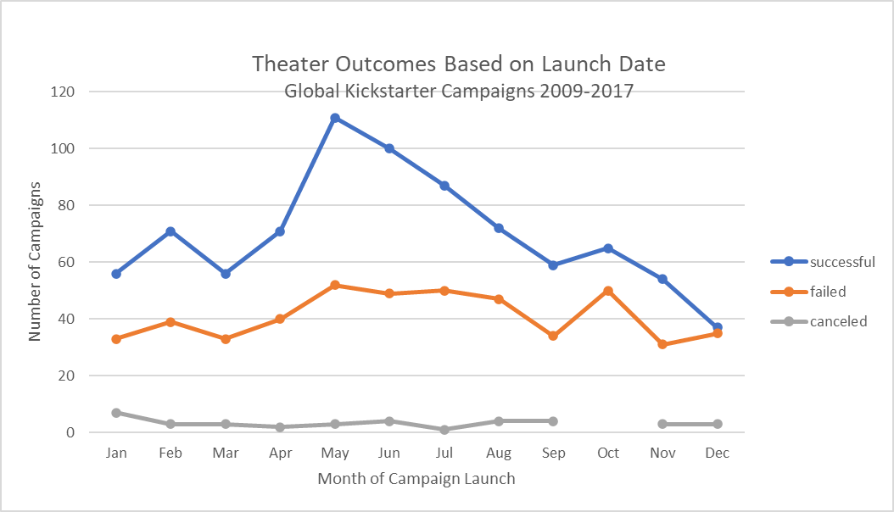
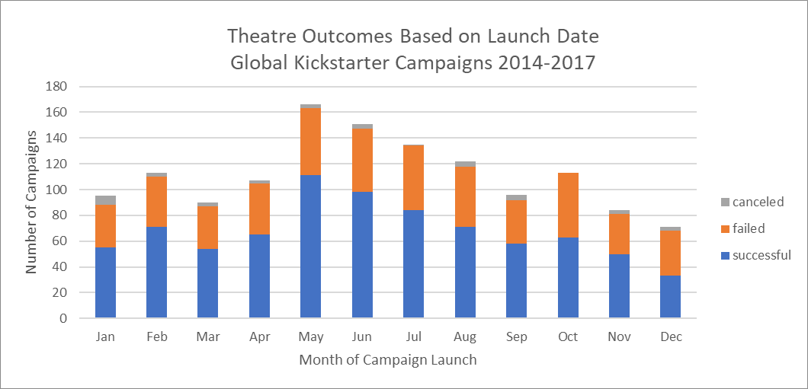
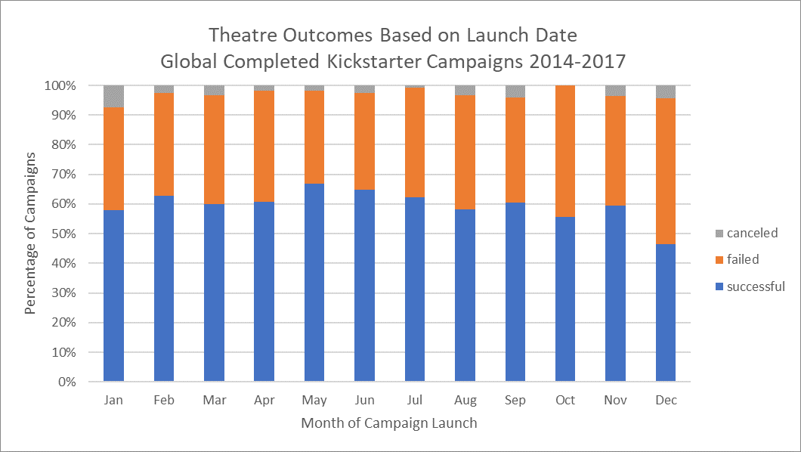
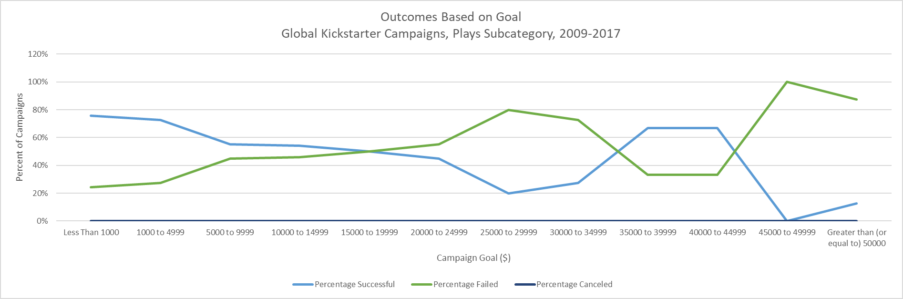
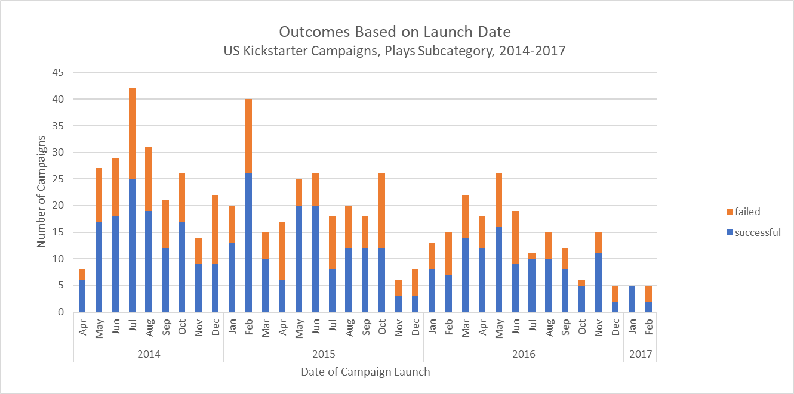

# Kickstarting with Excel

## Overview of Project
This project analyzed Kickstarter fundraising campaigns occurring between the years 2009 and 2017 in the plays subcategory to understand success and failure in meeting campaign goals relative to launch dates and funding goals.

### Purpose
Louise's fundraising campaign came close to it's goal. The purpose of this analysis is to help Louise understand the performance of similar Kickstarter campaigns. This knowledge could help improve her chances of reaching her goal should she wish to launch another campaign. It is important to keep in mind this is a historical, observational rather than experimental study. The identified relationships cannot be interpreted as causal and historical correlations may not hold for future campaigns. 

## Analysis and Challenges

### Analysis of Outcomes Based on Launch Date
The chart below shows the number of successes, failures and canceled campaigns, globally in the theater category, by the month the campaign was launched. 

  
 
 Campaigns launched in May through July showed a greater rate of success than other months of the year. The month of December was a particularly poor month for campaign success. 

It should be noted the dataset included no data on failures and cancelations for the years 2009 - 2013. The 100% success rate in these years can bias the results. Filtering out these years, however did not alter the general trends. 

Line graphs make judging the total number of campaigns and the rate of success by month difficult to discern. The stacked bar chart below clearly shows the months of May through July had the greatest number of campaigns. The number of campaigns launched was lowest in December. 

 

The 100% stacked bar chart below show the percentage of successes, failures and cancelation by month. Success rate may not vary as dramatically across months as the line graphs might suggest.

   

Conclusions: 
1) More campaigns were launched in the months May thru July; competition for donors will be highest in these months
2) Campaigns launched in May and June had the highest success rates and campaigns launched in December had the lowest success rate. 

### Analysis of Outcomes Based on Goals
 

The chart above shows the percentage of successes and failures in the plays subcategory by the campaign goal. There appears to be no correlation between success rate and campaign goal, but it is possible there are confounding factors that should be considered.

A possible confounding factor is the Staff Pick badge. It is generally accepted that kickstarter projects receiving this endorsement have increased odds of success. Unfortunately the reliability of this data is suspect. **A Hack A Day** study in 2015 ["The Problem with Kickstarter: A Lack of Transparency"](https://hackaday.com/2015/08/25/the-problem-with-kickstarter-a-lack-of-transparency/) reported Kickstarter staff pick badge status is correlated with success, but how the projects were selected is mysterious. A 2016 **The Next Web** story ["Kickstarter kills 'staff picks' in favor of official badges to avoid confusion"](https://thenextweb.com/news/kickstarter-kills-staff-picks-in-favor-of-official-badges-to-avoid-confusion) reported some campaigns forged their Staff Pick status. Assuming forged Staff Pick badges are not captured in the dataset, it is not possible to untangle the impact of the staff pick badge. 

It should be noted it is not clear whether the campaign goal is expressed in local currencies (as indicated by the column H) or if the goal has been converted into USD, as might be suggsted by the formatting of columns D and E. If goal is expressed in local curreny, any conclusions based on this graph are meaningless due to the inconsistent currency units.

Filtering the dataset to US Kickstarter campaigns for the subcategory plays, for the years 2014-2017 shows no correlation between outcomes and campaign goals.

Conclusions:

There is no correlation between campaign goal and campaign success rate in this dataset.

### Challenges and Difficulties Encountered
#### Lack of a data dictionary

One of the difficulties in analyzing this dataset is the lack of definition for each variable. Precise definitions, along with valid values and interpretations would be very helpful and ensure the data is interpretated correctly. For example. it is unclear whether the goal and pledges data is in local currency or converted into one common currency.

#### Incomplete data
Another issue is what seems to be the incomplete data for 2009-2013. Only successes are present. This raises the question of whether this is a complete dataset. I have dealt with this issue by assuming data is complete for the years 2014 - 2017 and limiting analysis to these years. 

#### Confounding factors
Although there is a substantial amount of data available, unavailable are many other factors that can impact the success of a campaign. For example, supplemental marketing efforts by the campaign owners, the genre of the play and the effectiveness of the play's description can be expected to play a role. A follow-on study could classify the plays subcategory campaigns on these factors.

## Results
- What are two conclusions you can draw about the Outcomes based on Launch Date?
 
1) More campaigns were launched in the months May thru July; competition for donors would be greatest in these months
2) Campaigns launched in May and June had the highest success rates and campaigns launched in December had the lowest success rate. 

- What can you conclude about the Outcomes based on Goals?

The data showed no correlation between success rate and campaign goal. It is possible there are confounding factors to be considered that may provide a clearer picture.

- What are some limitations of this dataset?

Data elements are not well-defined so assumptions had to be made about meaning, valid values, etc.

For the years 2009-2013, only successful campaigns are captured. For that reason, only the time period April 2014 - February 2017 can be used for analysis. 

- What are some other possible tables and/or graphs that we could create?

Success appears to be strictly defined as pledged >= goal. It may be useful to look at Percentage Funded as the measure of success. Looking at campaigns close to meeting the goal vs. further away may provide additional insight.

Another valuable analysis is to look at the data over time. The stacked bar chart below shows successes and failures over time. There appears to be a declining number of campaigns in the US plays subcategory from 2014 to 2017. It would be good to learn more about the reasons behind this trend. Maybe play companies are finding other options more valuable than Kickstarter.

